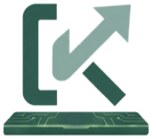
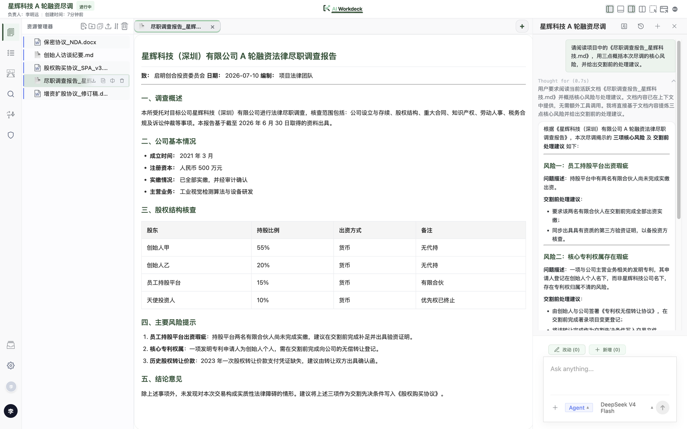
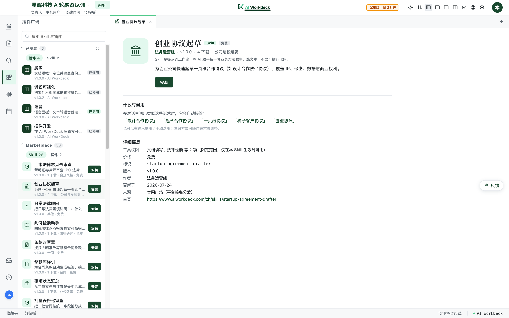
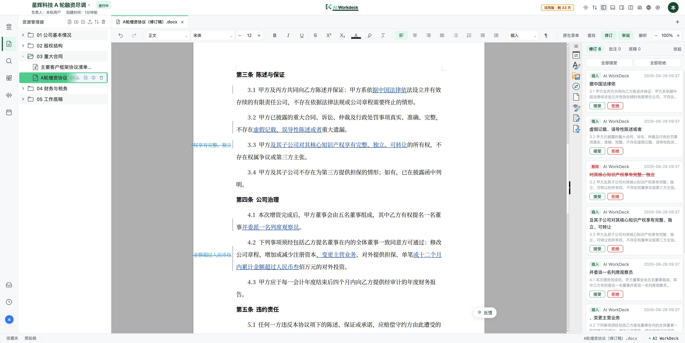
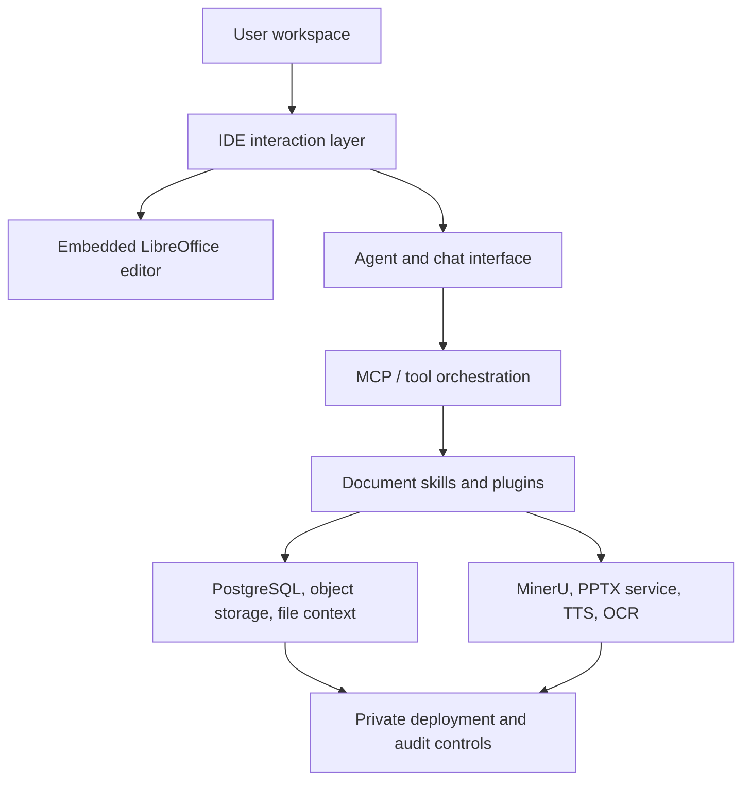

<p align="center">
  <a href="https://www.aiworkdeck.com">
    
  </a>
</p>

<h1 align="center">AI WorkDeck</h1>

<p align="center">
  <strong>The AI-native workspace for legal and document-heavy work.</strong><br>
  <sub>让法律人聚焦专业判断 — 面向法律与文档密集型团队的 AI 原生工作台</sub>
</p>

<p align="center">
  <a href="https://github.com/zeweihan/aiworkdeck/stargazers"></a>
  <a href="https://github.com/zeweihan/aiworkdeck/releases"></a>
  <a href="https://github.com/zeweihan/aiworkdeck/releases"></a>
  <a href="legal/LICENSE"></a>
  <a href="legal/COMMERCIAL-LICENSE.md"></a>
  <a href="https://www.aiworkdeck.com"></a>
</p>

<p align="center">
  <strong>English</strong> · <a href="README.zh-CN.md">简体中文</a>
</p>

<p align="center">
  <a href="https://www.aiworkdeck.com">
    
  </a>
</p>

---

> **VS Code** gives developers one place for files, extensions, terminals, Git, and AI coding assistants.
>
> **AI WorkDeck** aims to give lawyers and document-heavy teams one place for matters, documents, agents, plugins, evidence, and review.

## Why Star This Repo

Star AI WorkDeck if you care about any of these problems:

- Building AI-native legal or professional-service workflows
- Moving from chatbot add-ons to a real workspace where files, context, agents, and plugins live together
- Self-hosting document AI infrastructure with private data, audit trails, and organization-level workflows
- Exploring MCP-style agent orchestration, document parsing, embedded LibreOffice editing, AI slides, TTS, OCR, and evidence-chain workflows in one codebase

## What It Is

AI WorkDeck Community Edition is the full workbench, AGPL-licensed: the same desktop app, editor, agents and plugin runtime that ship in the official build. Commercial licensing exists for firms that need relief from AGPL obligations; it does not gate features. The source is published so developers, law firms, legal-tech builders, and document-AI teams can inspect, self-host, integrate, and extend it.

## Download & Run

Just want to try it? You don't need to build from source.

**➡️ [Download the latest desktop app](https://github.com/zeweihan/aiworkdeck/releases/latest)**

| Platform | Installer | Notes |
|---|---|---|
| macOS (Apple Silicon) | `AI WorkDeck-<version>-arm64.dmg` | Signed and notarized |
| Windows | `AI WorkDeck Setup <version>.exe` | Not yet code-signed; SmartScreen may warn |

> Intel mac builds are discontinued (upstream Python dependencies no longer ship x86_64 wheels). The last Intel dmg remains available in older releases.

Double-click to install, sign in, and start working. The official desktop build needs **no API keys and no infrastructure**: AI and external services run through the AI WorkDeck platform channel and are billed by usage (Credits), and the backend, a trimmed JRE, and a local database are bundled in — no Java, Docker, or PostgreSQL required. (Building from source instead? The self-hosted stack keeps configurable providers, including fully local models via [Ollama](https://ollama.com) — see [Quick Start](#quick-start).)

> The desktop build is the fastest way to evaluate AI WorkDeck. To self-host the full stack or contribute code, see [Quick Start](#quick-start) below.

## Access & Unlock

The desktop app asks you to sign in on first launch. Create an account at [aiworkdeck.com](https://www.aiworkdeck.com/start) — on the China site a mobile number and an SMS code is all it takes, and there is no separate registration step: an unrecognised number simply creates the account.

After signing in, the desktop app stores an account key on this machine and opens straight into the workspace from then on. **It does not need to be online every time**: authorisation carries a 30-day offline grace period, and any single online start within that window renews it. Aeroplanes and firm intranets are fine — documents open, edit and save as usual.

**If you already hold an account key** (team server, self-hosted deployment, or one you generated yourself on the account page with the `awdk_` prefix), switch to the "Account key" tab on the unlock screen and paste it. That path is unchanged.

Two notes for firms evaluating deployment: authorisation is per machine and is stored locally at `~/.aiworkdeck/`; a self-hosted team deployment (browser access to a shared server) has no unlock gate at all.

### Building it yourself: re-enabling offline trial codes

The offline trial-code path is still in the source; official binaries simply ship with it turned off. When building your own, change

```yaml
security:
  license:
    trial-code:
      enabled: false
```

in `backend/src/main/resources/application-desktop.yml` to `true` and the previous behaviour returns in full (offline signature verification, no network, nothing about your machine reported anywhere). This is a default value, not a tamper-protection mechanism.

## Demo

| | |
|---|---|
| Website | [aiworkdeck.com](https://www.aiworkdeck.com) |
| Product walkthrough | [Intro video](https://www.aiworkdeck.com/videos/intro.mp4) |
| Feature showcase | [AI WorkDeck Showcase](https://www.aiworkdeck.com/zh/showcase) |

## Screenshots

All real product screenshots (demo project, every name and document fictitious). Below: the in-app plugin & skill marketplace pulling live entries from the online registry, and the document workbench with AI-authored tracked changes and the review panel.

<p align="center">
  
</p>
<p align="center">
  
</p>

## Core Capabilities

| Area | What the community edition provides |
|---|---|
| **Workspace** | Project/file tree, document staging, favorites, clipboard memory, work logs, calendar and task management, light/dark themes |
| **AI document work** | Drafting, review, extraction, desensitization, Markdown and document preview |
| **Agent layer** | Main agent interface, streaming responses, contextual file tags, MCP-oriented orchestration |
| **Document editing** | Embedded LibreOffice (WASM) editor with native zh-CN UI, local DOCX editing with tracked changes, a review panel for accepting/rejecting redlines and comments, AI editor primitives (docx/xlsx/pptx/pdf), document links, diff viewing |
| **Version history** | Git-backed per-project version records: timeline, per-version diffs, revert, milestones, parallel drafts |
| **Document insight** | Entity extraction (companies, statutes, cases), external registry lookups, internal consistency checks, an evidence/reference pane |
| **Legal workflows** | Due-diligence workbench, shareholder-meeting verification, litigation visualization (timelines, flowcharts, party graphs) |
| **Parsing and generation** | MinerU document parsing, AI PPT generation, on-device text-to-speech, meeting-recording transcription |
| **Plugin surface** | In-app plugin & skill marketplace, left-sidebar plugins, a public plugin SDK with examples (`sdk/`, `examples/`), dedicated panes for vertical workflows |
| **Companions** | Microsoft Office add-in (Word/Excel/PowerPoint task pane), mobile capture & project sync relay |
| **Deployment** | Java/Spring backend, Vue/uni-app frontend, Electron desktop shell, Dockerized services |
| **Governance** | Private deployment path, audit-friendly workflow records, commercial licensing path |

## Architecture




## Data Processing & Privacy

AI WorkDeck is designed for **self-hosted, private deployment**. The following diagram shows which components process data locally vs. externally:

```
┌─────────────────────────────────────────────────────────────────┐
│  Your Infrastructure (private network)                          │
│                                                                 │
│  ┌──────────┐  ┌──────────┐  ┌──────────┐  ┌────────────────┐  │
│  │ AI Agent │  │  MinerU  │  │   PPTX   │  │ Sensitive Data │  │
│  │ (Ollama) │  │ (Docker) │  │ (Docker) │  │    Masking     │  │
│  │  LOCAL   │  │  LOCAL   │  │  LOCAL   │  │     LOCAL      │  │
│  └──────────┘  └──────────┘  └──────────┘  └────────────────┘  │
│                                                                 │
│  ┌──────────┐  ┌──────────┐  ┌──────────────────────────────┐  │
│  │PostgreSQL│  │   RAG    │  │    Local File Storage        │  │
│  │  LOCAL   │  │  LOCAL   │  │          LOCAL               │  │
│  └──────────┘  └──────────┘  └──────────────────────────────┘  │
│                                                                 │
├────────────────────────── Optional External ────────────────────┤
│  ┌──────────┐  ┌──────────┐  ┌──────────┐  ┌──────────────┐   │
│  │   OCR    │  │ Meeting  │  │ Company  │  │  Gemini /    │   │
│  │ (Aliyun) │  │ (Tingwu) │  │(Qichacha)│  │  OpenRouter  │   │
│  │ EXTERNAL │  │ EXTERNAL │  │ EXTERNAL │  │  CONFIGURABLE│   │
│  └──────────┘  └──────────┘  └──────────┘  └──────────────┘   │
└─────────────────────────────────────────────────────────────────┘
```

| Component | Default Location | Can Run Locally? | Notes |
|---|---|---|---|
| AI inference (chat/agent) | Local (Ollama) in self-hosted builds | ✅ Yes | Official desktop builds use the platform channel (Credits) instead; self-hosted default is localhost:11434 |
| RAG / embeddings | Local (Apache Tika) | ✅ Yes | InMemoryEmbeddingStore |
| Document parsing (MinerU) | Local (Docker) | ✅ Yes | No external call |
| PPTX generation | Local (Docker) | ✅ Yes | No external call |
| Sensitive data masking | Local (regex) | ✅ Yes | Chinese PII patterns, no external call |
| Document storage | Local filesystem | ✅ Yes | Configurable: local / OSS / S3 |
| OCR | **Platform-sourced** (relayed to Aliyun through our servers) | No local fallback | Default on fresh installs; switchable to your own key or disabled |
| Text-to-speech | Local engine (bundled Kokoro) | Yes | On-device only; there is no cloud path |
| Company data lookup | **Platform-sourced** (relayed to Qichacha through our servers) | No local fallback | Default on fresh installs; switchable to your own key or disabled |
| Meeting transcription | **Platform-sourced** (audio staged in our object storage, deleted on completion) | On-device engine ships in a later version | Default on fresh installs; switchable to your own key or disabled |
| AI model (cloud) | **External** (Gemini/OpenRouter) | ✅ Use Ollama | Configurable provider |
| Anonymous usage stats | Local ledger + daily aggregated counts | ✅ Can be disabled | Counts and enum values only, no content; one switch in Settings, see legal/PRIVACY.md |

**For air-gapped deployments**: Ollama + local storage + MinerU + PPTX service keeps all documents entirely within your network. Disable OCR, company data, meeting transcription, and cloud AI providers — the core workspace, document editing, agent orchestration, and due-diligence workflows function without external services. Speech synthesis needs no disabling: it is on-device already.

## Evidence Chain & Audit Status

> **Status**: Version history and relational audit logging are in place; cryptographic provenance is on the roadmap.

The Community Edition currently provides:

- **Version history**: a Git-backed per-project version system (`com.checkba.version`) with a timeline, per-version file diffs, revert, milestones, and parallel draft branches
- **Activity logging**: `UserActivityLog` records every user action (LOGIN, OPEN_FILE, PAGE_VIEW, etc.) with timestamps via Hibernate `@CreationTimestamp` and metadata stored as JSON
- **Due-diligence tracking**: `DdItem` records state transitions (PENDING → UPLOADED → APPROVED/REJECTED) with `uploadedAt` and `uploadedBy`
- **Conversation audit**: `ConversationFileChange` logs document additions and modifications per session
- **File metadata**: `ProjectFile` stores `createdAt`/`updatedAt` timestamps and file paths in PostgreSQL

**What is NOT yet implemented** (on the roadmap):
- Cryptographic document hashing (SHA-256 checksums)
- Tamper-evident audit trails (Merkle chains or signed logs)
- Immutable append-only evidence log

The architecture's plugin surface is designed to accommodate these features. If you need cryptographic provenance for compliance or litigation support, please open an issue describing your requirements — it helps us prioritize.

## Licensing FAQ for Law Firms

### Can our firm use AI WorkDeck internally without disclosing our modifications?

**Usually yes — with one nuance worth understanding.** AGPLv3 affirms your right to run the software and to modify it for your own use. Running an *unmodified* copy internally creates no source-disclosure obligation. If you *modify* AI WorkDeck and then make the modified version available to people over a network — which can include your own lawyers and staff using it as an internal web application — AGPLv3 Section 13 can require you to offer **those users** the corresponding source code of your modified version. That source stays within your firm: you are not required to publish it to the public or to us. If you would rather keep your modifications, plugins, or integrations proprietary and free of any AGPLv3 obligation, a commercial license removes the copyleft requirement entirely.

### What about the network-use clause (AGPLv3 Section 13)?

Section 13 is triggered by **network interaction with a modified version**, and the people entitled to the corresponding source are the **users of that modified version**. Two common cases:

- **Internal tool behind your firewall (modified).** Your staff are the users. You may need to offer them the corresponding source, but you are not required to disclose it publicly or to us. An unmodified deployment carries no such obligation.
- **Client-facing portal or external service (modified).** Your clients are the users, and AGPLv3 would require offering them the source of your modified version. If you do not want to do that, a commercial license is the clean path.

### What about proprietary plugins and extensions?

The current architecture runs plugins in-process. Under AGPLv3, this means the copyleft *may* extend to proprietary plugins. If your firm plans to build proprietary workflow extensions, the **commercial license** provides a clean legal basis for:
- Closed-source plugins and integrations
- Proprietary on-premise deployment without source disclosure
- Commercial SaaS products built on the AI WorkDeck kernel

See [`legal/COMMERCIAL-LICENSE.md`](legal/COMMERCIAL-LICENSE.md) or contact [hi@aiworkdeck.com](mailto:hi@aiworkdeck.com).

### Where does our data go?

**AI conversations do not pass through our servers.** Conversation content goes straight from your machine to the model provider you selected: with local Ollama it is processed on the device only; with a cloud provider it goes to that third party; and even on the "AI WorkDeck cloud" tier our servers only issue the key and settle usage. Documents and contract text, AI conversation text, file names, and project and client information therefore never flow through our servers — and in a self-hosted deployment with Ollama + local storage + Docker services, **they never leave your network at all**.

**The platform-sourced tier does pass through our servers.** On a fresh desktop install, image text recognition, web search, company registry data, securities and financial data, statute and case law search, and meeting transcription default to the "platform-sourced" tier: AI WorkDeck buys from the vendor on your behalf and bills in Credits, so no key of your own is needed, and the content each call requires is relayed to the vendor through our servers. Meeting audio is the only item staged in our object storage — deleted as soon as transcription finishes, with a 24-hour lifecycle rule as a backstop; every other service passes content through only at call time and retains no request content. All six vendors are inside mainland China. Speech synthesis is not among them: it has an on-device tier only, synthesizing locally in the bundled engine. The per-service breakdown (what passes through, how long it is kept, when it is deleted) is in [`legal/PRIVACY.md`](legal/PRIVACY.md).

**Every item can be switched.** Under Settings → Platform Services any of them can be moved to your own key (the desktop app then connects to that vendor directly, bypassing us) or to an on-device tier, or disabled entirely; existing installs that already have a vendor key configured are not moved. Team-hosted server deployments and the Office add-in are always own-key — the platform-sourced tier is not offered to them.

The app shares anonymous aggregated usage statistics by default (daily counts of feature usage only, tied to a random install ID) to help improve the product; this can be turned off with one switch in Settings, and the exact data shape is documented in [`legal/PRIVACY.md`](legal/PRIVACY.md).

## Quick Start

> For developers who want to self-host the full stack or contribute code. If you just want to try the app, use [Download & Run](#download--run) above instead.

### Prerequisites

| Requirement | Version |
|---|---|
| Docker Desktop | Latest (for MinerU, PPTX, TTS services) |
| Java | 17+ (JDK 21 also supported) |
| Node.js | 18+ |
| PostgreSQL | 14+ |

### Steps

```bash
# 1. Clone
git clone https://github.com/zeweihan/aiworkdeck.git
cd aiworkdeck

# 2. Configure environment
cp backend/.env.example backend/.env.production
cp pptx-service/.env.example pptx-service/.env

# 3. Create database
# Create a PostgreSQL database named `checkba`
# or update backend environment variables for your own database name

# 4. Start all services
chmod +x restart-all.sh
./restart-all.sh
```

### Services

| Service | URL |
|---|---|
| Frontend | `http://localhost:5173` |
| Backend | `http://localhost:9696` |
| PPTX service | `http://localhost:5001` |
| MinerU service | `http://localhost:8001` |

Text-to-speech runs on-device (bundled Kokoro engine); `restart-all.sh` no longer starts the legacy EasyVoice Docker service, though its definition remains in `docker-compose.yml`.

Common optional providers: OpenRouter, Gemini, Qichacha, Tushare, PKULaw, Aliyun (OCR and Tingwu transcription), and object storage. Not every provider is required to inspect the code or run the basic workbench.

## Repository Map

| Path | Purpose |
|---|---|
| `backend/` | Spring Boot backend, agent/tool APIs, document services |
| `frontend/` | Vue/uni-app web frontend for the workbench |
| `desktop/` | Electron desktop shell |
| `pptx-service/` | AI-native PPT generation service |
| `mineru-service/` | MinerU-based document parsing service |
| `easyvoice/` | Text-to-speech service |
| `docs/` | Engineering notes, editor migration notes, storage and workflow docs |
| `legal/` | AGPLv3 license, CLA, commercial license, trademark terms |

## Roadmap

Shipped since this list was first written: the public plugin SDK with examples, due-diligence and shareholder-meeting workflows, litigation visualization, and Git-backed version history with diffs. Still ahead:

- [ ] Cleaner one-command local demo with sample data
- [ ] Cryptographic provenance: document hashing, tamper-evident audit trails
- [ ] On-device meeting-transcription engine (today's default relays through platform servers)
- [ ] More legal-document workflows: contract review, standalone evidence timelines
- [ ] Better self-hosting guides for private law-firm and enterprise deployments
- [ ] Bilingual documentation for the community edition

## Governance

AI WorkDeck is developed in the open, with a contributor → reviewer → maintainer ladder, an RFC process for substantial changes, and a monthly community call — see [GOVERNANCE.md](GOVERNANCE.md) and [MAINTAINERS.md](MAINTAINERS.md). The project is stewarded by 北京京微资易科技有限公司 (with 真善美承泽有限公司 / Zhen Shan Mei Grace Legacy Limited operating the international offering), which holds the trademarks and is the sole commercial licensor. Governance roles carry technical authority, not economic rights.

### Community Fund

We commit **20% of net commercial-licensing revenue** to a community fund that pays issue bounties ([BOUNTIES.md](BOUNTIES.md)), Skill-creation grants, and community events. This is a unilateral public policy of the steward company, not a contractual promise to any individual; the percentage and rules may be adjusted prospectively as the project grows.

## Contributing

We welcome issues, discussions, docs improvements, integration notes, and focused pull requests. Please read [CONTRIBUTING.md](.github/CONTRIBUTING.md) before submitting a PR. Code contributions require a one-time [CLA signature](legal/CLA.md), handled automatically by a bot on your first PR. Issues labeled `bounty` pay cash on merge — see [BOUNTIES.md](BOUNTIES.md).

Useful first contributions:

- Reproduce and document local setup paths on different operating systems
- Improve self-hosting docs and `.env` examples
- Add plugin examples
- Add tests around document parsing, agent tool calls, and frontend workflows
- Improve English and Chinese documentation

### Share a Skill or publish a plugin — no PR needed

The fastest way to contribute is through the marketplace, and what you publish reaches every desktop install:

- **Submit a Skill** (a reusable prompt-based workflow — contract review, drafting, verification): [aiworkdeck.com/zh/skills](https://www.aiworkdeck.com/zh/skills) (China) or [workdeck.ai/en/skills](https://www.workdeck.ai/en/skills) (international). Skills go live immediately after sign-in, and an AI assistant on the form helps turn a one-line idea into a complete skill.
- **Publish a plugin** (JAR or web plugin built on the [plugin SDK](sdk/plugin-sdk/README.md), starting from [`examples/`](examples/)): submit it at [aiworkdeck.com/zh/plugins](https://www.aiworkdeck.com/zh/plugins) or [workdeck.ai/en/plugins](https://www.workdeck.ai/en/plugins) — every plugin is human-reviewed and Ed25519-signed before it is listed, and paid listings on the China site share revenue with the author.
- **Request a feature**: open a [GitHub issue](https://github.com/zeweihan/aiworkdeck/issues), or use the [feature-request form](https://www.aiworkdeck.com/en/feature-request) on the website — submissions land directly in our triage queue.

## Licensing

AI WorkDeck Community Edition is released under the GNU Affero General Public License v3.0.

If you modify this project and provide it as a network service, AGPLv3 generally requires that you provide the corresponding source code to users of that service.

Commercial licensing is available for:

- Closed-source SaaS delivery
- Proprietary on-premise delivery
- Commercial products that need to integrate the kernel without releasing proprietary modifications
- Dedicated enterprise support and implementation assistance

See [LICENSE](legal/LICENSE) and [COMMERCIAL-LICENSE.md](legal/COMMERCIAL-LICENSE.md). For commercial licensing, contact [hi@aiworkdeck.com](mailto:hi@aiworkdeck.com).

The **AI WorkDeck logo** (the "K" mark) is a registered trademark in China (Classes 9, 35, and 42; reg. nos. 89857424, 89857389, 89857390). "**AI WorkDeck**" is used as a trade name and unregistered word mark ("AI WorkDeck™"), protected together with the aiworkdeck.com domain under applicable unfair-competition law. Building on the kernel is welcome under the licenses above, but using the **AI WorkDeck** name or logo to market a commercial offering requires a brand or certification agreement — see [TRADEMARKS.md](legal/TRADEMARKS.md) and the **Brand & Certification Programs** in [COMMERCIAL-LICENSE.md](legal/COMMERCIAL-LICENSE.md).

## Background

Read [WHY.md](WHY.md) for the product thesis and founder story.

---

## ⭐ Star History

<p align="center">
  <a href="https://github.com/zeweihan/aiworkdeck/stargazers">
    
  </a>
</p>
<p align="center">
  <sub>Self-hosted chart, refreshed weekly by <a href=".github/workflows/star-history.yml">a scheduled workflow</a>.</sub>
</p>

<p align="center">
  If this direction matters to you, please <a href="https://github.com/zeweihan/aiworkdeck/stargazers">⭐ star the repo</a> and share it with someone building legal AI, document AI, or professional-service infrastructure.
</p>
