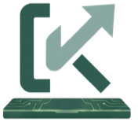
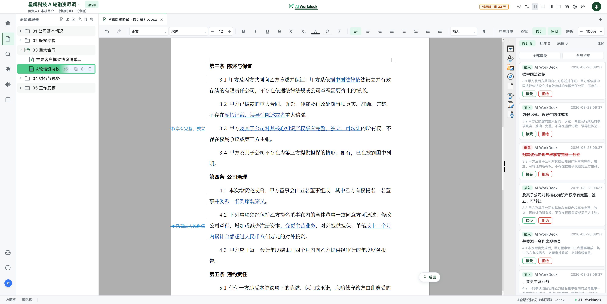
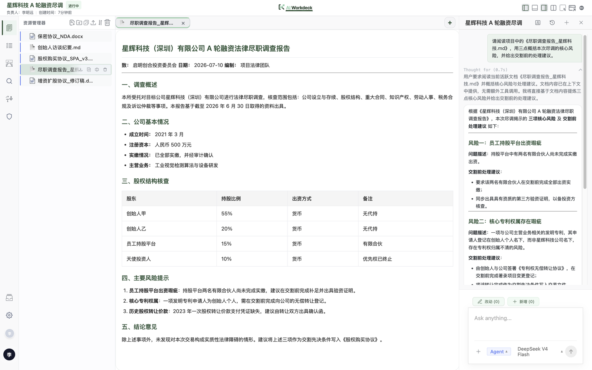
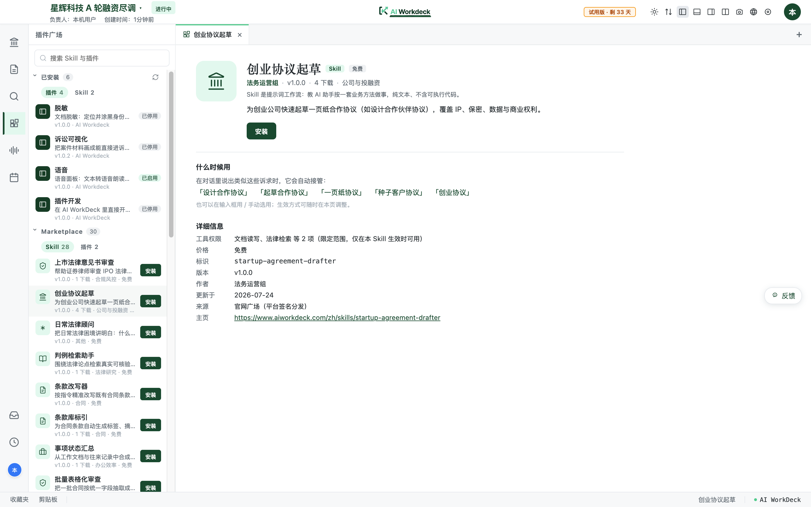

  

<h1 align="center">AI WorkDeck</h1>

  <strong>The open-source AI workspace for professional document work.</strong> 
  From source material to a reviewed deliverable — starting with legal work.

  
  
  

  <strong>English</strong> · <a href="README.zh-CN.md">简体中文</a> 
  <a href="WHY.md">Our thesis</a> · <a href="#build-with-us">Build with us</a> · <a href="docs/architecture.md">Architecture</a> · <a href="https://github.com/AI-WorkDeck/aiworkdeck/releases/latest">Download</a> · <a href="mailto:hi@aiworkdeck.com">Investment & partnerships</a>

A contract is ready when someone can stand behind it. That means checking its sources, negotiating changes, preserving the document's structure, and knowing which version was approved. Producing the first draft is only part of the job.

**AI WorkDeck brings those steps into one extensible workspace.** Agents work alongside the document editor, project files, source references, and version history. A lawyer can inspect an AI-authored change in the document, accept or reject it, and keep the work in the project's history. Developers can build on the same editor, agent tools, and plugin runtime.

**We are building a shared foundation for professional AI:** start with demanding legal workflows, make the underlying document operations reusable, and enable specialists to build the next applications on top.

  
   Real product capture from an earlier build, using fictional materials. Interface details vary by release.

## Why this is worth building

AI coding tools have shown the value of bringing an agent into the environment where work happens. Professional document work needs that same depth of integration: an understanding of the file being edited, the material behind it, the changes being proposed, and the person responsible for the result.

We are starting with legal work because these requirements meet in almost every matter. A due-diligence finding needs a source. A negotiated clause needs a review trail. A final document needs to survive handoff to someone using Word. Solving these together creates a foundation that can also serve transaction advisory, compliance, and other document-intensive professions.

**Our bet is that the enduring value lies in connecting context, action, and review.** Better models expand what an agent can do; the workspace makes that capability useful in a real professional process. Read the [product thesis](WHY.md) for the expansion path and the questions we still need to prove.

## What you can inspect today

This repository contains the desktop app, workbench, agent backend, document-editor integration, and plugin runtime. It is a working codebase with [desktop releases](https://github.com/AI-WorkDeck/aiworkdeck/releases), [public development history](https://github.com/AI-WorkDeck/aiworkdeck/commits/master/), and [CI](https://github.com/AI-WorkDeck/aiworkdeck/actions/workflows/ci.yml).

| Foundation | Why it matters | Explore it |
|---|---|---|
| **Document-native agent actions** | Apply fine-grained edits through structured tools; inspect tracked changes and comments in the embedded LibreOffice WASM editor, with checkpoint recovery available. | [Editor primitives](docs/AI_EDITOR_PRIMITIVES.md) · [Editor bridge](frontend/src/zetaoffice/) |
| **Source-linked work** | Connect a passage to its supporting material, navigate back to the source, and detect changed or missing anchors. Extend retrieval through an evidence-provider interface. | [Evidence contract](docs/EVIDENCE_CONTRACT.md) · [Provider example](examples/hello-evidence-plugin/) |
| **Project history and collaboration** | Compare parallel drafts with three-way document merge workflows and inspect paragraph-level provenance, backed by Git history. | [Version engine](backend/src/main/java/com/checkba/version/) |
| **An extensible workbench** | Add web panes, Java tools, declarative templates, or reusable Skills without rebuilding the entire application. | [Plugin guide](docs/plugin-guide.md) · [SDK](sdk/plugin-sdk/) · [Examples](examples/) |
| **Professional workflows** | Due diligence, contract review, source checking, and litigation visualization give the platform concrete places to develop. | [Built-in Skills](backend/skills/) · [Visualization engine](litviz/) |
| **Multiple ways into the work** | The desktop workbench and Office/WPS task panes connect AI assistance to existing document workflows. | [Desktop](desktop/) · [Office add-in](office-addin/) |

The engineering focus is the quality of the resulting file: preserving structure, making edits reviewable, and keeping sources traceable through revision. The [roadmap](#roadmap) identifies the next problems contributors can help solve.

<strong>See the workspace and extension marketplace</strong>

  
  

Earlier product captures using fictional demo materials. For an evaluation build, use the [latest release](https://github.com/AI-WorkDeck/aiworkdeck/releases/latest).

## Build with us

A developer should be able to spend their effort on a valuable workflow and reuse the document infrastructure beneath it. There are several concrete entry points:

| Build | Reuse | First step |
|---|---|---|
| A focused review or research pane | Project files, document access, host events, and UI integration | Run the [minimal web plugin](examples/hello-web-plugin/) — plain HTML and JavaScript, no build step. |
| A connection to a specialist source | The evidence-retrieval interface and its conformance tests | Extend the [evidence-provider example](examples/hello-evidence-plugin/). |
| A reusable professional workflow | The agent's tools and Skill loading | Read the [Skill specification](docs/SKILL_SPEC.md) and inspect [existing Skills](backend/skills/). |
| Templates and house styles | Declarative contributions, without executable backend code | Start from the [declarative plugin](examples/hello-declarative-plugin/). |
| A stronger core | The editor bridge, version engine, and agent runtime | Read [architecture](docs/architecture.md), then [run from source](docs/getting-started.md). |

Web plugins use a sandboxed iframe and a permission-checked bridge. Java plugins run in the backend process and must be trusted. The [plugin guide](docs/plugin-guide.md) explains those boundaries and the publication process.

### Contributing

Start by turning a review or research task you know well into an extension. If you prefer improving the core, a small reproducible case is especially valuable: a document that loses formatting, a source link that no longer resolves, an edit that fails to round-trip, or an unclear setup step. Use synthetic or appropriately redacted materials and describe the expected result. Discuss the scope in an [issue](https://github.com/AI-WorkDeck/aiworkdeck/issues) before starting a large change.

Read the [contribution guide](.github/CONTRIBUTING.md). Code contributions require a one-time [CLA](legal/CLA.md); contributors retain copyright and grant the steward dual-licensing rights. Substantial API changes use the [RFC process](GOVERNANCE.md#rfc-process). The [governance model](GOVERNANCE.md) provides a path from contributor to reviewer to maintainer, and the [current maintainers](MAINTAINERS.md) are public.

Plugin and Skill authors can also publish through the marketplace: [China](https://www.aiworkdeck.com/zh/plugins) · [International](https://www.workdeck.ai/en/plugins). Author ownership, paid-listing revenue sharing, review, and settlement are described in the [marketplace terms](legal/MARKETPLACE-TERMS.md). For individual funded tasks, see the [bounty policy](BOUNTIES.md); availability and amounts are set per issue.

## Roadmap

The next stage is about making this foundation easier to trust and easier to build on. These are contribution directions, not dated release commitments:

- **Reliable document work:** reproducible cases for complex layouts, long documents, tracked changes, and undo; evaluate the saved and reopened document as well as the agent's response.
- **Verifiable sources:** strengthen source-link survival across edits and retrieval-provider conformance; explore cryptographic provenance separately from ordinary history and citations.
- **A shorter path for builders:** a clean local demo, clearer self-hosting instructions, more plugin examples, and bilingual contributor documentation.
- **Repeatable professional workflows:** turn narrowly scoped tasks into Skills and extensions with explicit inputs, review steps, and testable outputs.

Bring a concrete use case to [Discussions](https://github.com/AI-WorkDeck/aiworkdeck/discussions) or propose a focused [issue](https://github.com/AI-WorkDeck/aiworkdeck/issues). Developers and practitioners can help define the work together.

## Open source and the business

The open-source workbench gives builders code they can inspect, adapt, and extend. The commercial model combines usage-based platform services, commercial licensing and implementation support, and a marketplace for specialist workflows. The growth thesis is to earn a place in recurring legal work, support organizations deploying it, and let specialist builders extend it into adjacent workflows. Each useful extension gives another team a reason to adopt the foundation; a shared runtime reduces what the next builder has to recreate.

The steward is **北京京微资易科技有限公司 (Beijing Jingwei Ziyi Technology Co., Ltd.)**; **真善美承泽有限公司 (Zhen Shan Mei Grace Legacy Limited)** operates the international offering. Commercial licensing covers the steward's code; third-party components retain their own terms. See [commercial licensing](legal/COMMERCIAL-LICENSE.md), [third-party components](legal/THIRD-PARTY-COMPONENTS.md), and [trademarks](legal/TRADEMARKS.md).

### Community Fund

The steward's existing policy allocates **20% of net commercial-licensing revenue** to a community fund for bounties, Skill-creation grants, and community events. This is a public policy that may be adjusted prospectively, not an individual contractual entitlement. Governance roles carry technical authority; economic terms are set separately in the [bounty policy](BOUNTIES.md) and [marketplace terms](legal/MARKETPLACE-TERMS.md).

**Interested in investing, building a vertical product, or becoming an implementation partner?** Contact [hi@aiworkdeck.com](mailto:hi@aiworkdeck.com) to discuss the product, technical foundation, and commercial direction. We want partners who care about the quality of the work delivered, and builders who want to shape how professional agents work.

## Evaluate the project

- **Try the product:** [macOS / Windows releases](https://github.com/AI-WorkDeck/aiworkdeck/releases/latest) · [Product walkthrough](https://www.aiworkdeck.com/zh/showcase).
- **Explore or run the source:** [Getting started](docs/getting-started.md) · [Architecture](docs/architecture.md). The contributor stack uses JDK 21, Maven, Node/npm, and PostgreSQL; optional sidecars have additional requirements.
- **Understand the data paths:** [Privacy and service data flows](legal/PRIVACY.md). Desktop editing uses local storage by default; cloud models, platform services, hosted add-ins, and sync have different data paths. Self-hosting requires configuration and deployment-specific verification.
- **Understand the rights:** [AGPL-3.0-or-later](legal/LICENSE) · [CLA](legal/CLA.md) · [Commercial licensing](legal/COMMERCIAL-LICENSE.md).

Follow [releases](https://github.com/AI-WorkDeck/aiworkdeck/releases), join a [discussion](https://github.com/AI-WorkDeck/aiworkdeck/discussions), or build a small extension. The most useful next step is something we can inspect and improve together.
