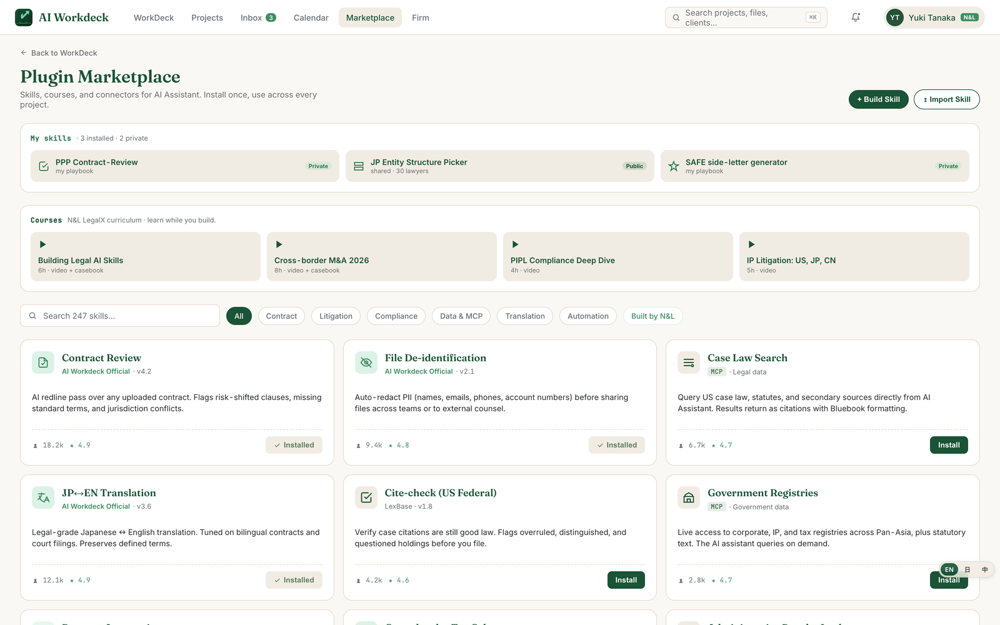
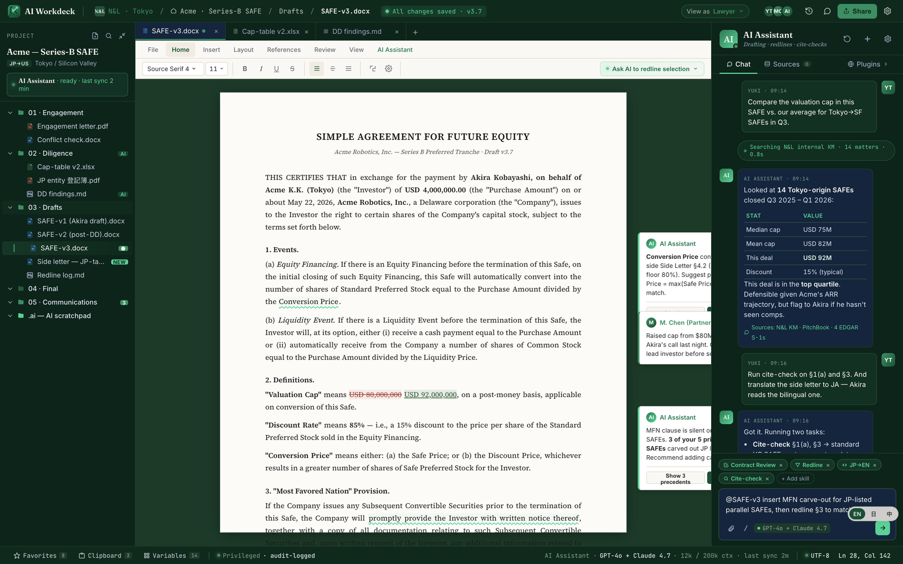
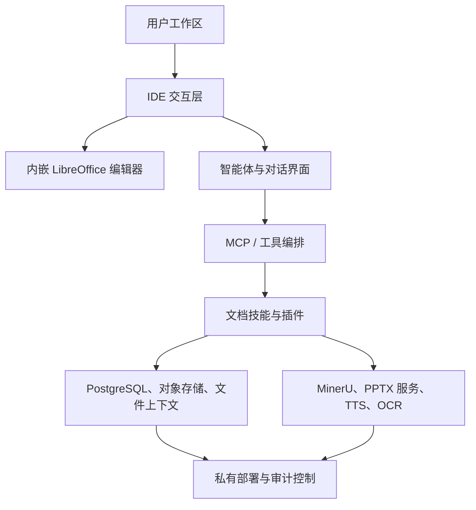
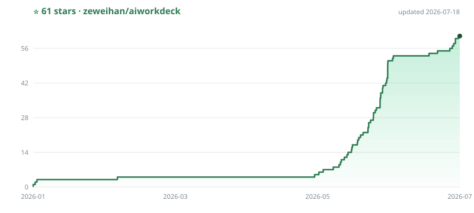

<p align="center">
  <a href="https://www.aiworkdeck.com">
    
  </a>
</p>

<h1 align="center">AI Workdeck</h1>

<p align="center">
  <strong>让法律人聚焦专业判断 — 面向法律与文档密集型工作的 AI 原生工作台</strong>
</p>

<p align="center">
  <a href="https://github.com/zeweihan/aiworkdeck/stargazers"></a>
  <a href="https://github.com/zeweihan/aiworkdeck/releases"></a>
  <a href="https://github.com/zeweihan/aiworkdeck/releases"></a>
  <a href="legal/LICENSE"></a>
  <a href="legal/COMMERCIAL-LICENSE.md"></a>
  <a href="https://www.aiworkdeck.com"></a>
</p>

<p align="center">
  <a href="README.md">English</a> · <strong>简体中文</strong>
</p>

<p align="center">
  <a href="https://www.aiworkdeck.com">
    
  </a>
</p>

---

> **VS Code** 把文件、扩展、终端、Git 和 AI 编程助手装进了开发者的同一个工作台。
>
> **AI Workdeck** 想为律师和文档密集型团队做同样的事：项目、文档、智能体、插件、证据与审查，尽在一处。

## 为什么值得 Star

如果你关心下面任何一个问题，欢迎为 AI Workdeck 点一颗 ⭐：

- 构建 AI 原生的法律 / 专业服务工作流
- 从「聊天机器人外挂」进化为文件、上下文、智能体、插件真正共存的工作台
- 私有化部署文档 AI 基础设施：数据私有、留痕可审计、面向组织级工作流
- 在同一套代码里探索 MCP 式智能体编排、文档解析、内嵌 LibreOffice 编辑、AI PPT、语音合成、OCR 与证据链工作流

## 这是什么

AI Workdeck 社区版是 AI Workdeck 的开源内核，不等于完整的商业 SaaS 产品。开源内核的目的，是让开发者、律所、法律科技团队和文档 AI 团队可以审查、私有部署、集成和扩展这套核心工作流基础设施。

## 下载即用

只是想试试？不需要从源码构建。

**➡️ [下载最新版桌面应用](https://github.com/zeweihan/aiworkdeck/releases/latest)**

| 平台 | 安装包 | 说明 |
|---|---|---|
| macOS（Apple Silicon） | `AI Workdeck-<version>-arm64.dmg` | 已签名并公证 |
| Windows | `AI Workdeck Setup <version>.exe` | 暂未代码签名，SmartScreen 可能提示，选择「仍要运行」即可 |

> Intel 芯片 Mac 的构建已停止（上游 Python 依赖不再提供 x86_64 版本），旧版本 Release 中仍保留最后一个 Intel dmg。

双击安装。首次启动会有配置向导，选择一个 AI 提供方即可：填一个云端 API Key，或用 [Ollama](https://ollama.com) 跑完全本地的模型（零 Key，数据不出本机）。无需 Java、Docker 或 PostgreSQL——后端、精简版 JRE 和本地数据库都已打进安装包。

> 桌面版是体验 AI Workdeck 最快的方式。想自部署完整服务栈或参与开发，请看下方[快速开始](#快速开始)。

## 演示

| | |
|---|---|
| 官网 | [aiworkdeck.com](https://www.aiworkdeck.com/zh) |
| 产品视频 | [功能演示视频](https://www.aiworkdeck.com/videos/intro.mp4) |
| 功能演练 | [AI Workdeck 功能演练](https://www.aiworkdeck.com/zh/showcase) |

## 界面截图

顶部工作区为**真实产品截图**（演示项目，数据为虚构）。下面两张分别是插件 / Skill 广场，以及文档工作台的设计预览稿（后续版本的方向）。

<p align="center">
  
</p>
<p align="center">
  
</p>

## 核心能力

| 领域 | 开源内核提供什么 |
|---|---|
| **工作区** | 项目 / 文件树、文档暂存、收藏、剪贴板记忆、工作记录 |
| **AI 文档工作** | 起草、审查、要素抽取、脱敏、Markdown 与文档预览 |
| **智能体层** | 主智能体界面、流式回复、上下文文件标签、MCP 式工具编排 |
| **文档编辑** | 内嵌 LibreOffice（WASM）编辑器（原生中文界面）、本地 DOCX 修订编辑、AI 编辑器原语、文档内链、差异对比 |
| **解析与生成** | MinerU 文档解析、AI PPT 生成、语音合成工作流 |
| **插件面** | 左栏插件、工具配置、垂直工作流专属面板 |
| **部署** | Java/Spring 后端、Vue/uni-app 前端、Electron 桌面壳、Docker 化服务 |
| **治理** | 私有化部署路径、可审计的工作记录、商业授权路径 |

## 架构



## 数据处理与隐私

AI Workdeck 为**自托管、私有化部署**而设计。下图标注了哪些组件在本地处理数据、哪些走外部服务：

```
┌─────────────────────────────────────────────────────────────────┐
│  你的基础设施（内网）                                             │
│                                                                 │
│  ┌──────────┐  ┌──────────┐  ┌──────────┐  ┌────────────────┐  │
│  │ AI 智能体 │  │  MinerU  │  │   PPTX   │  │    敏感信息     │  │
│  │ (Ollama) │  │ (Docker) │  │ (Docker) │  │     脱敏        │  │
│  │  本地    │  │  本地    │  │  本地     │  │     本地        │  │
│  └──────────┘  └──────────┘  └──────────┘  └────────────────┘  │
│                                                                 │
│  ┌──────────┐  ┌──────────┐  ┌──────────────────────────────┐  │
│  │PostgreSQL│  │   RAG    │  │        本地文件存储            │  │
│  │  本地    │  │  本地    │  │           本地                │  │
│  └──────────┘  └──────────┘  └──────────────────────────────┘  │
│                                                                 │
├───────────────────────────── 可选外部服务 ───────────────────────┤
│  ┌──────────┐  ┌──────────┐  ┌──────────┐  ┌──────────────┐   │
│  │   OCR    │  │   TTS    │  │  企业数据  │  │  Gemini /    │   │
│  │ (阿里云)  │  │(ElevenLb)│  │ (企查查)  │  │  OpenRouter  │   │
│  │  外部    │  │  外部     │  │  外部     │  │   可配置      │   │
│  └──────────┘  └──────────┘  └──────────┘  └──────────────┘   │
└─────────────────────────────────────────────────────────────────┘
```

| 组件 | 默认位置 | 可完全本地？ | 说明 |
|---|---|---|---|
| AI 推理（对话 / 智能体） | 本地（Ollama） | ✅ 可以 | 默认 localhost:11434 |
| RAG / 向量化 | 本地（Apache Tika） | ✅ 可以 | InMemoryEmbeddingStore |
| 文档解析（MinerU） | 本地（Docker） | ✅ 可以 | 无外部调用 |
| PPTX 生成 | 本地（Docker） | ✅ 可以 | 无外部调用 |
| 敏感信息脱敏 | 本地（正则） | ✅ 可以 | 中文 PII 模式，无外部调用 |
| 文档存储 | 本地文件系统 | ✅ 可以 | 可配置：本地 / OSS / S3 |
| OCR | **外部**（阿里云） | ⚠️ 无本地回退 | 可关闭 |
| 语音合成 | **外部**（ElevenLabs） | ⚠️ 无本地回退 | 可关闭 |
| 企业数据查询 | **外部**（企查查） | ⚠️ 无本地回退 | 可选功能 |
| 云端大模型 | **外部**（Gemini/OpenRouter） | ✅ 可换 Ollama | 提供方可配置 |

**离线 / 内网隔离部署**：Ollama + 本地存储 + MinerU + PPTX 服务的组合可以让所有文档完全不出内网。关闭 OCR、TTS 与云端模型后，核心工作区、文档编辑、智能体编排与尽调工作流均可正常使用。

## 证据链与审计现状

> **现状**：基础已就位，密码学级溯源在路线图上。

社区版目前提供**关系型审计日志**：

- **行为日志**：`UserActivityLog` 记录每个用户动作（登录、打开文件、页面访问等），带 Hibernate `@CreationTimestamp` 时间戳与 JSON 元数据
- **尽调追踪**：`DdItem` 记录状态流转（待上传 → 已上传 → 通过/退回），含 `uploadedAt` 与 `uploadedBy`
- **会话审计**：`ConversationFileChange` 按会话记录文档新增与修改
- **文件元数据**：`ProjectFile` 在 PostgreSQL 中存储 `createdAt`/`updatedAt` 与文件路径

**尚未实现**（在路线图上）：
- 文档密码学哈希（SHA-256 校验和）
- 防篡改审计链（Merkle 链或签名日志）
- 文件版本历史与差异追踪
- 不可变的只追加证据日志

插件架构在设计上已为这些能力预留了位置。如果你的合规或诉讼支持场景需要密码学级溯源，欢迎开 issue 描述需求——这会直接影响我们的优先级排序。

## 律所使用许可 FAQ

### 律所内部使用 AI Workdeck，需要公开我们的修改吗？

**通常不需要——但有一个值得理解的细节。** AGPLv3 保障你运行软件、以及为自用而修改软件的权利。内部运行*未修改*的副本不产生任何源码披露义务。如果你*修改*了 AI Workdeck，并通过网络把修改版提供给他人使用——这可能包括你所内律师和员工把它当内部 Web 应用使用——AGPLv3 第 13 条可能要求你向**这些用户**提供修改版的对应源码。这些源码留在所内即可：你不需要向公众或向我们公开。如果你希望修改、插件或集成保持专有、完全不受 AGPLv3 约束，商业许可可以彻底移除 copyleft 义务。

### 网络使用条款（AGPLv3 第 13 条）怎么理解？

第 13 条由**与修改版的网络交互**触发，有权获得对应源码的是**修改版的用户**。两种常见情形：

- **防火墙内的内部工具（有修改）**：用户是你的员工。你可能需要向他们提供对应源码，但不需要向公众或向我们披露。未修改的部署没有此义务。
- **面向客户的门户或对外服务（有修改）**：用户是你的客户，AGPLv3 会要求向他们提供修改版源码。如果不想这样做，商业许可是干净的路径。

### 专有插件和扩展呢？

当前架构中插件在进程内运行。在 AGPLv3 下，copyleft *可能*延伸到专有插件。如果贵所计划构建专有工作流扩展，**商业许可**为以下场景提供干净的法律基础：
- 闭源插件与集成
- 不披露源码的专有本地化部署
- 基于 AI Workdeck 内核构建的商业 SaaS 产品

详见 [`legal/COMMERCIAL-LICENSE.md`](legal/COMMERCIAL-LICENSE.md)，或联系 [hi@aiworkdeck.com](mailto:hi@aiworkdeck.com)。

### 我们的数据去哪了？

在 Ollama + 本地存储 + Docker 服务的自托管部署中，**文档永远不离开你的网络**。默认无遥测、无回传、无统计分析。可选外部服务（OCR、TTS、云端模型）均需显式配置，且可完全关闭。

## 快速开始

> 面向想自部署完整服务栈或参与开发的开发者。只想试用应用请直接看上方[下载即用](#下载即用)。

### 环境要求

| 依赖 | 版本 |
|---|---|
| Docker Desktop | 最新版（用于 MinerU、PPTX、TTS 服务） |
| Java | 17+（也支持 JDK 21） |
| Node.js | 18+ |
| PostgreSQL | 14+ |

### 步骤

```bash
# 1. 克隆
git clone https://github.com/zeweihan/aiworkdeck.git
cd aiworkdeck

# 2. 配置环境变量
cp backend/.env.example backend/.env.production
cp pptx-service/.env.example pptx-service/.env

# 3. 创建数据库
# 创建名为 `checkba` 的 PostgreSQL 数据库
# 或修改后端环境变量指向你自己的数据库

# 4. 启动全部服务
chmod +x restart-all.sh
./restart-all.sh
```

### 服务地址

| 服务 | 地址 |
|---|---|
| 前端 | `http://localhost:5173` |
| 后端 | `http://localhost:9696` |
| PPTX 服务 | `http://localhost:5001` |
| MinerU 服务 | `http://localhost:8001` |
| EasyVoice | `http://localhost:9549` |

常见可选提供方：OpenRouter、Gemini、企查查、Tushare、ElevenLabs、北大法宝与对象存储。审查代码或运行基础工作台并不要求配齐所有提供方。

## 仓库结构

| 路径 | 用途 |
|---|---|
| `backend/` | Spring Boot 后端，智能体/工具 API，文档服务 |
| `frontend/` | Vue/uni-app 工作台前端 |
| `desktop/` | Electron 桌面壳 |
| `pptx-service/` | AI 原生 PPT 生成服务 |
| `mineru-service/` | 基于 MinerU 的文档解析服务 |
| `easyvoice/` | 语音合成服务 |
| `docs/` | 工程笔记、编辑器迁移笔记、存储与工作流文档 |
| `legal/` | AGPLv3 许可、CLA、商业许可、商标条款 |

## 路线图

- [ ] 更干净的一键本地演示（带示例数据）
- [ ] 公开插件 SDK 与示例插件
- [ ] 更多法律文书工作流：尽职调查、股东会审查、合同审查、证据时间线
- [ ] 面向律所与企业私有化部署的更好的自托管指南
- [ ] 更可审计的工作记录：版本历史、差异、引注与审查日志
- [ ] 社区版双语文档

## 参与贡献

欢迎 issue、讨论、文档改进、集成笔记和目标明确的 PR。提交 PR 前请先阅读 [CONTRIBUTING.md](.github/CONTRIBUTING.md)。

适合上手的第一批贡献：

- 在不同操作系统上复现并记录本地部署路径
- 改进自托管文档与 `.env` 示例
- 添加插件示例
- 为文档解析、智能体工具调用和前端工作流补测试
- 改进中英文文档

## 许可

AI Workdeck 社区版基于 GNU Affero General Public License v3.0 发布。

如果你修改了本项目并将其作为网络服务提供，AGPLv3 通常要求你向该服务的用户提供对应源码。

以下场景可获得商业许可：

- 闭源 SaaS 交付
- 专有本地化交付
- 需要集成内核但不公开专有修改的商业产品
- 企业级支持与实施协助

详见 [LICENSE](legal/LICENSE) 与 [COMMERCIAL-LICENSE.md](legal/COMMERCIAL-LICENSE.md)。商业许可请联系 [hi@aiworkdeck.com](mailto:hi@aiworkdeck.com)。

**AI Workdeck®** 是中国注册商标（第 9、35、42 类）。欢迎在上述许可下基于内核构建产品，但将 **AI Workdeck** 名称或标识用于商业产品需要品牌或认证协议——见 [TRADEMARKS.md](legal/TRADEMARKS.md) 与 [COMMERCIAL-LICENSE.md](legal/COMMERCIAL-LICENSE.md) 中的**品牌与认证计划**。

## 背景

产品理念与创始故事见 [WHY.md](WHY.md)。

---

## ⭐ Star 趋势

<p align="center">
  <a href="https://github.com/zeweihan/aiworkdeck/stargazers">
    
  </a>
</p>
<p align="center">
  <sub>自托管曲线图，由<a href=".github/workflows/star-history.yml">定时工作流</a>每周自动刷新。</sub>
</p>

<p align="center">
  如果你认同这个方向，请 <a href="https://github.com/zeweihan/aiworkdeck/stargazers">⭐ Star 本仓库</a>，并分享给正在做法律 AI、文档 AI 或专业服务基础设施的朋友。
</p>
