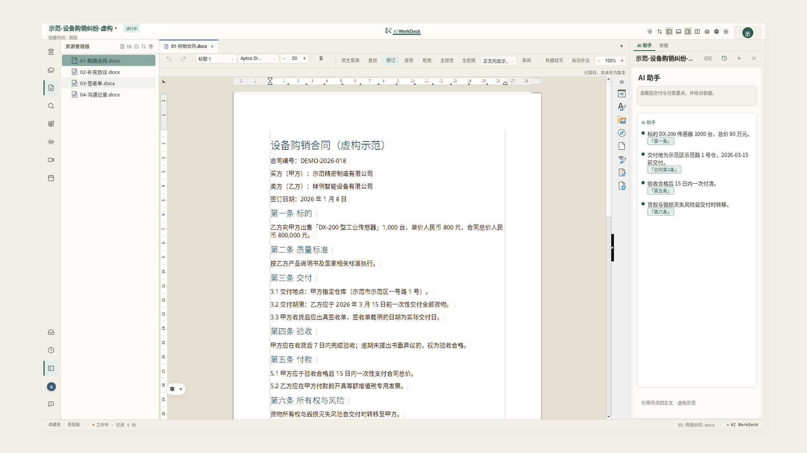
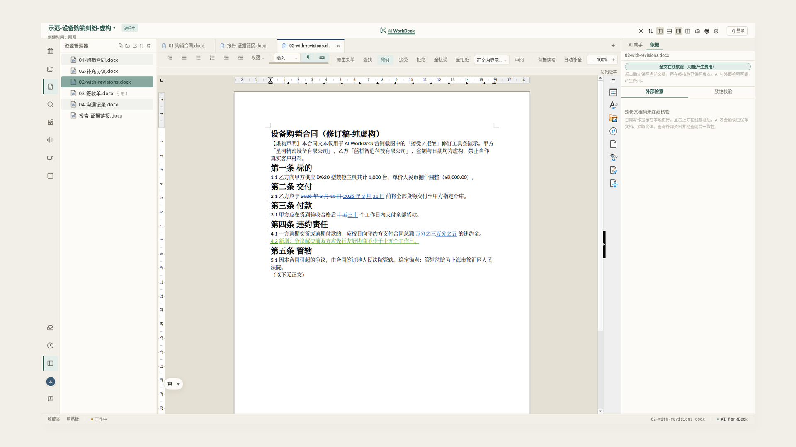
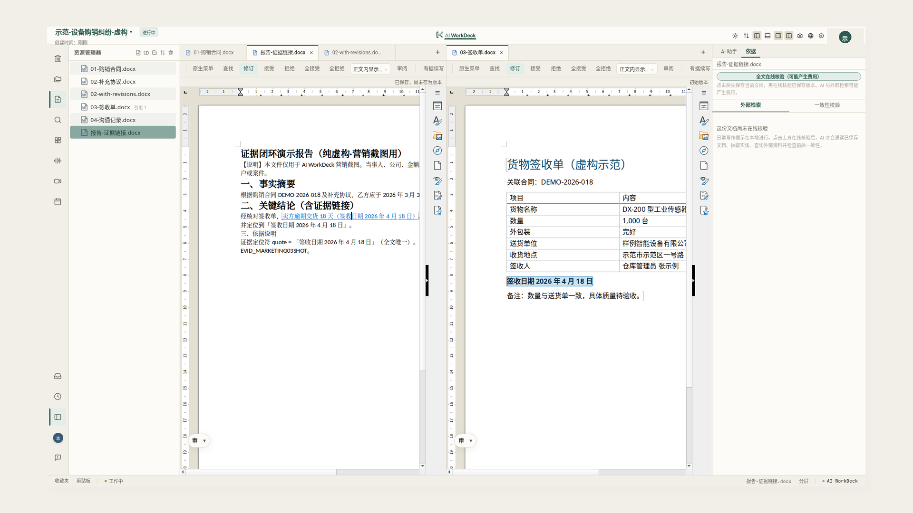

  

<h1 align="center">AI WorkDeck</h1>

  <strong>专业文档工作的开源 AI 工作台</strong> 
  从原始材料到经过审阅的交付成果，从法律工作出发。

  
  
  

  <a href="README.md">English</a> · <strong>简体中文</strong> 
  <a href="WHY.zh-CN.md">产品判断</a> · <a href="#一起建设">一起建设</a> · <a href="docs/architecture.md">技术架构</a> · <a href="https://github.com/AI-WorkDeck/aiworkdeck/releases/latest">下载体验</a> · <a href="mailto:hi@aiworkdeck.com">投资与合作</a>

一份合同能够交付，意味着有人愿意对它负责。为此，需要核对依据、协商修改、保留文档结构，也需要知道哪一版经过了谁的审阅。写出初稿，只是其中一步。

<strong>AI WorkDeck 把这些工作放进同一个可扩展的工作台。</strong> 智能体与文档编辑器、项目文件、来源依据和版本记录共同工作。律师可以在文档里检查 AI 提出的修改，逐项接受或拒绝，并把成果保留在项目历史中。开发者则可以在同一套编辑器、智能体工具和插件运行时之上，构建自己的专业工作流。

<strong>我们希望把它建设成专业 AI 的共同基础：</strong>从要求严格的法律场景切入，将底层文档能力做成可复用的接口，让不同领域的开发者能够在其上继续创造。

  
   工作台 — 项目文件、文档与 AI 同屏。演示材料为虚构内容。

  
   接受 / 拒绝修订 — AI 以修订写入文档，由你逐项审阅。

  
   证据跳转 — 打开引用即可落到支撑结论的原文位置。

## 为什么值得做

AI 编程工具已经展示了智能体进入实际工作环境的价值。专业文档工作同样需要这种深度：理解正在编辑的文件、支撑结论的材料、准备提出的修改，以及最终对成果负责的人。

我们从法律工作切入，因为这些要求几乎同时出现在每一个项目中。尽调结论需要依据，谈判条款需要修订记录，最终文件还要交给使用 Word 的客户和交易对手。把这些环节做好，所形成的基础能力也有机会服务于交易咨询、合规以及更多依赖文档交付的专业领域。

<strong>我们的判断是，长期价值在于把上下文、实际操作和专业审阅连接起来。</strong> 模型进步扩大了智能体的能力范围，工作台让这些能力进入真实业务流程。[产品判断](WHY.zh-CN.md)进一步说明了这条发展路径，以及仍需验证的问题。

## 今天已经可以检查什么

本仓库包含桌面应用、工作台、智能体后端、文档编辑器集成和插件运行时。这里有可以运行的代码、[桌面安装包](https://github.com/AI-WorkDeck/aiworkdeck/releases)、[公开开发记录](https://github.com/AI-WorkDeck/aiworkdeck/commits/master/)和[持续集成结果](https://github.com/AI-WorkDeck/aiworkdeck/actions/workflows/ci.yml)。

| 基础能力 | 对专业工作的价值 | 查看实现 |
|---|---|---|
| <strong>直接操作文档的智能体</strong> | 通过结构化工具作细粒度修改，在内嵌 LibreOffice WASM 编辑器中审阅修订与批注，并提供检查点恢复路径。 | [编辑原语](docs/AI_EDITOR_PRIMITIVES.md) · [编辑器桥接](frontend/src/zetaoffice/) |
| <strong>与依据相连的成果</strong> | 将段落与支撑材料关联，回到来源核查，检测锚点内容变化或丢失；通过证据提供方接口扩展检索。 | [依据关联契约](docs/EVIDENCE_CONTRACT.md) · [提供方示例](examples/hello-evidence-plugin/) |
| <strong>项目历史与协作</strong> | 基于 Git 保留历史，通过三方文档合并流程比较平行稿，并查看段落级来源归属。 | [版本引擎](backend/src/main/java/com/checkba/version/) |
| <strong>可扩展的工作台</strong> | 增加网页面板、Java 工具、声明式模板或可复用 Skill，复用已有应用基础。 | [插件指南](docs/plugin-guide.md) · [SDK](sdk/plugin-sdk/) · [示例](examples/) |
| <strong>具体的专业工作流</strong> | 尽职调查、合同审查、依据核查和诉讼可视化，为平台能力提供明确的落点。 | [内置 Skills](backend/skills/) · [可视化引擎](litviz/) |
| <strong>进入现有工作环境的入口</strong> | 桌面工作台与 Office/WPS 任务窗格，让 AI 参与已有的文档工作流程。 | [桌面端](desktop/) · [Office 加载项](office-addin/) |

工程工作的重点，是最终文件的质量：保留结构、让修改可以审阅、让依据在多轮修订后仍可核查。[下一步](#下一步)列出了值得贡献者共同解决的问题。

<strong>查看扩展广场</strong>

  

扩展广场截图使用虚构演示材料。实际评估请使用[最新版本](https://github.com/AI-WorkDeck/aiworkdeck/releases/latest)。

## 一起建设

开发者应当能够把精力投入有价值的业务流程，同时复用底层文档能力。这里有几种具体的起点：

| 想做什么 | 可以复用什么 | 从哪里开始 |
|---|---|---|
| 专门的审查或研究面板 | 项目文件、文档访问、宿主事件与界面集成 | 运行[最小网页插件](examples/hello-web-plugin/)，使用普通 HTML 和 JavaScript，无需构建。 |
| 接入某一类专业资料来源 | 证据检索接口及其一致性测试 | 扩展[证据提供方示例](examples/hello-evidence-plugin/)。 |
| 可复用的专业工作流 | 智能体工具与 Skill 加载机制 | 阅读 [Skill 规范](docs/SKILL_SPEC.md)，参考[现有 Skills](backend/skills/)。 |
| 文书模板与机构样式 | 无需后端执行代码的声明式扩展 | 从[声明式插件示例](examples/hello-declarative-plugin/)开始。 |
| 改进核心能力 | 编辑器桥接、版本引擎与智能体运行时 | 先读[架构](docs/architecture.md)，再[从源码启动](docs/getting-started.md)。 |

网页插件运行在沙箱 iframe 中，通过检查权限的桥接接口调用宿主；Java 插件在后端进程中运行，需要信任其代码。[插件指南](docs/plugin-guide.md)说明了这些边界和发布流程。

### 参与贡献

可以先把你熟悉的一项审查或研究流程做成扩展。如果更愿意改进核心能力，也可以从一个小而可复现的问题开始：某份文档丢失了格式，某条依据无法重新定位，某次修改保存后重开不一致，或者某个安装步骤不够清楚。请使用合成或适当脱敏的材料，说明预期结果。较大的改动，先在 [Issue](https://github.com/AI-WorkDeck/aiworkdeck/issues) 中讨论范围。

提交前阅读[贡献指南](.github/CONTRIBUTING.md)。代码贡献需一次性签署 [CLA](legal/CLA.md)：贡献者保留著作权，并授权项目管理方按开源与商业许可两种方式分发。重要 API 改动走 [RFC 流程](GOVERNANCE.md#rfc-process)。[治理规则](GOVERNANCE.md)提供了从贡献者到审阅者、维护者的成长路径，[现任维护者](MAINTAINERS.md)公开列明。

插件与 Skill 作者也可以通过广场发布作品：[中国站](https://www.aiworkdeck.com/zh/plugins) · [国际站](https://www.workdeck.ai/en/plugins)。作品权利、付费分成、审核和结算按[广场条款](legal/MARKETPLACE-TERMS.md)执行。单项资助任务见[悬赏政策](BOUNTIES.md)，是否开放及具体金额以对应 Issue 为准。

## 下一步

下一阶段，我们希望让这套基础更可靠，也更容易被开发者复用。以下是参与方向，不是带有确定日期的发版承诺：

- <strong>可靠的文档操作：</strong>为复杂排版、长文档、修订和撤销积累可复现样例，同时检查智能体回复与保存、重开后的实际文件。
- <strong>可以核查的来源：</strong>完善修改后的依据定位和检索提供方一致性；将密码学溯源作为独立方向，区别于普通版本记录和引用。
- <strong>更短的开发起步路径：</strong>清晰的本地演示、私有部署说明、更多插件样例与双语贡献文档。
- <strong>能够重复执行的专业流程：</strong>把范围明确的任务做成 Skill 和扩展，说明输入、审阅环节以及可检验的输出。

欢迎带着具体场景参与 [Discussions](https://github.com/AI-WorkDeck/aiworkdeck/discussions)，或提出范围清楚的 [Issue](https://github.com/AI-WorkDeck/aiworkdeck/issues)。开发者与专业人士可以一起定义这些工作。

## 开源与商业如何相互支持

开源工作台给开发者提供可以检查、修改和扩展的代码。商业模式包括按用量计费的平台服务、商业许可与实施支持，以及分发专业工作流的广场。我们希望先进入经常发生的法律工作，再支持机构部署，并让专业开发者向相邻场景扩展。一个有用的扩展，可以成为另一类团队采用工作台的理由；共同的运行环境，则减少后来者需要重复建设的基础工作。

项目管理方为<strong>北京京微资易科技有限公司</strong>，国际业务由<strong>真善美承泽有限公司（Zhen Shan Mei Grace Legacy Limited）</strong>运营。商业许可覆盖管理方拥有权利的代码，第三方组件仍遵循各自条款。详见[商业许可](legal/COMMERCIAL-LICENSE.md)、[第三方组件](legal/THIRD-PARTY-COMPONENTS.md)与[商标说明](legal/TRADEMARKS.md)。

### 社区基金

管理方现行政策将<strong>商业许可净收入的 20%</strong>用于社区基金，支持悬赏、Skill 创作资助与社区活动。这是一项可向未来调整的公开政策，不构成对个人的合同性权益承诺。治理角色对应技术权限，经济安排另按[悬赏政策](BOUNTIES.md)与[广场条款](legal/MARKETPLACE-TERMS.md)执行。

<strong>希望投资、基于这套基础开发垂直产品，或成为实施合作伙伴？</strong> 欢迎联系 [hi@aiworkdeck.com](mailto:hi@aiworkdeck.com)，交流产品、技术基础与商业方向。我们期待关心交付质量的合作伙伴，也期待愿意共同定义专业智能体工作方式的开发者。

## 进一步了解

- <strong>体验产品：</strong>[macOS / Windows 安装包](https://github.com/AI-WorkDeck/aiworkdeck/releases/latest) · [产品演示](https://www.aiworkdeck.com/zh/showcase)。
- <strong>阅读或运行源码：</strong>[开发入门](docs/getting-started.md) · [技术架构](docs/architecture.md)。贡献者环境使用 JDK 21、Maven、Node/npm 和 PostgreSQL；可选服务另有依赖。
- <strong>核对数据流向：</strong>[隐私与服务数据说明](legal/PRIVACY.md)。桌面编辑默认使用本地存储；云端模型、平台服务、托管加载项和同步各有数据路径，私有部署需要结合配置逐项验证。
- <strong>了解许可：</strong>[AGPL-3.0-or-later](legal/LICENSE) · [CLA](legal/CLA.md) · [商业许可](legal/COMMERCIAL-LICENSE.md)。

可以从关注[版本更新](https://github.com/AI-WorkDeck/aiworkdeck/releases)、参与一场[讨论](https://github.com/AI-WorkDeck/aiworkdeck/discussions)，或写一个小扩展开始。具体的成果，会让我们更清楚下一步值得一起做什么。
