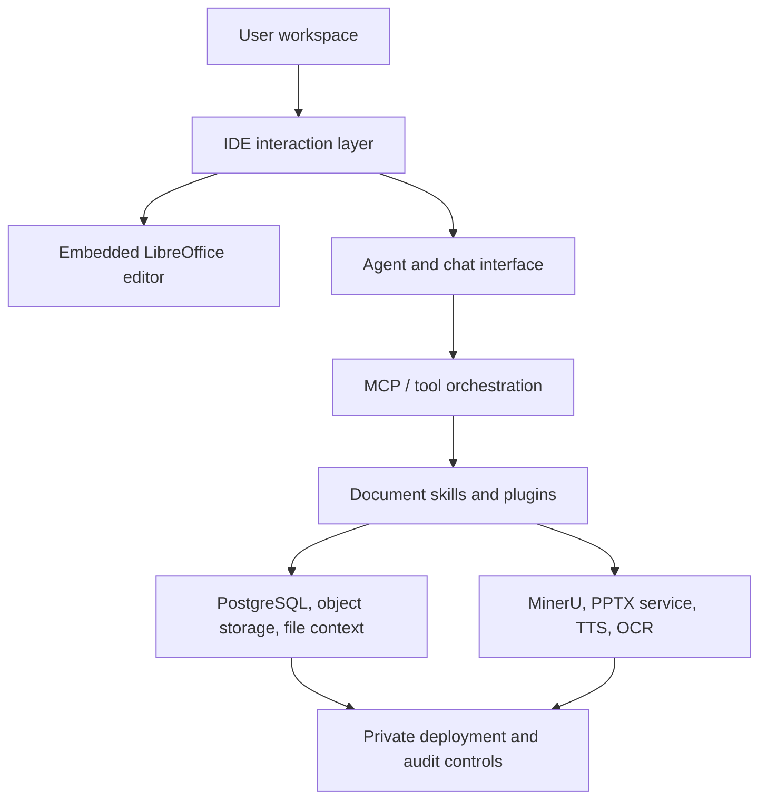

# Architecture

AI WorkDeck is an AI-native workspace for legal and document-heavy work. The community edition is the same desktop app, editor, agent runtime, and plugin host that ship in the official build.

## How the pieces fit

| Layer | Role | Where |
|---|---|---|
| Desktop shell | Electron window, local JRE, bundled backend | `desktop/` |
| Workbench UI | Vue / uni-app: file tree, chat, editor chrome, plugin panes | `frontend/` |
| Backend | Spring Boot: agents, tools, files, auth, plugins | `backend/` |
| Document editor | LibreOffice WASM (LOWA / zetaoffice) with tracked changes | `frontend/` + editor bridge |
| Sidecar services | MinerU parse, PPTX generation, on-device TTS | `mineru-service/`, `pptx-service/`, `kokoro-service/` |
| Plugins | In-process JAR tools and sandboxed web panes | `backend/plugins/`, `sdk/`, `examples/` |

The AI stack is seven layers that only depend downward: HTTP/SSE → agent loop → chat/multimodal services → context assembly → tools/plugins → memory → model factory. The invariants (orchestrator does not import concrete tools, memory read/write stay split, identity fields are injected server-side, SSE event names are a public contract) are in [AI_ARCHITECTURE.md](AI_ARCHITECTURE.md).

## Repository map

| Path | Purpose |
|---|---|
| `backend/` | Spring Boot API, agent/tool runtime, document services |
| `frontend/` | Vue/uni-app workbench |
| `desktop/` | Electron shell |
| `office-addin/` | Word / Excel / PowerPoint task pane |
| `sdk/plugin-sdk/` | Web-plugin bridge SDK (source of truth) |
| `examples/` | Minimal JAR and web plugins |
| `legal/` | AGPLv3, CLA, commercial license |

## Deeper specs

- [AI orchestrator baseline](AI_ARCHITECTURE.md)
- [Editor primitives](AI_EDITOR_PRIMITIVES.md)
- [Plugin spec](PLUGIN_SPEC.md) and [plugin guide](plugin-guide.md)
- [Skill spec](SKILL_SPEC.md)
- [Storage](STORAGE_CONFIG.md)
- [Evidence contract](EVIDENCE_CONTRACT.md)
- [Getting started](getting-started.md)

Internal PRDs, audits, and implementation logs live in [dev-notes/](dev-notes/).
