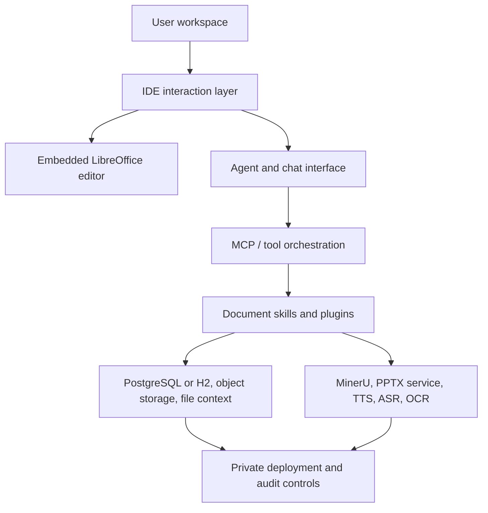

<!-- SPDX-FileCopyrightText: 2026 北京京微资易科技有限公司 and AI WorkDeck contributors -->
<!-- SPDX-License-Identifier: AGPL-3.0-or-later -->

# Architecture

> Originally contributed by @AzazelSensei in #730; refreshed 2026-09-29.

AI WorkDeck is an AI-native workspace for legal and document-heavy work. The community edition is the same desktop app, editor, agent runtime, and plugin host that ship in the official build.

## How the pieces fit

```mermaid
flowchart TB
  User["User workspace"] --> IDE["IDE interaction layer"]
  IDE --> LO["Embedded LibreOffice editor"]
  IDE --> Agent["Agent and chat interface"]
  Agent --> MCP["MCP / tool orchestration"]
  MCP --> Skills["Document skills and plugins"]
  Skills --> Data["PostgreSQL or H2, object storage, file context"]
  Skills --> Services["MinerU, PPTX service, TTS, ASR, OCR"]
  Data --> Security["Private deployment and audit controls"]
  Services --> Security
```

| Layer | Role | Where |
|---|---|---|
| Desktop shell | Electron window, trimmed JRE, bundled backend, local H2 database under `~/.aiworkdeck/` | `desktop/` |
| Workbench UI | Vue 3 / uni-app: file tree, tabs, chat, editor chrome, plugin panes | `frontend/` |
| Backend | Spring Boot: agents, tools, files, accounts, plugins, skills | `backend/` |
| Document editor | LibreOffice WASM (LOWA / zetaoffice) with tracked changes | `frontend/` + editor bridge |
| Sidecar services | MinerU parsing, PPTX generation, on-device TTS (Kokoro) and speech-to-text | `mineru-service/`, `pptx-service/`, `kokoro-service/`, `asr-service/` |
| Plugins and skills | In-process JAR tools, sandboxed web panes, declarative contributions, prompt-based skills | `backend/skills/`, `backend/plugin-api/`, `sdk/`, `examples/` |

The packaged desktop app needs no Java, Docker, or PostgreSQL: the backend runs on a bundled JRE with an H2 file database, and heavy optional components are downloaded on demand as signed native packs ([NATIVE_PACK_DISTRIBUTION.md](NATIVE_PACK_DISTRIBUTION.md)). The from-source stack uses PostgreSQL, and Docker for the MinerU and PPTX sidecars; see [Getting started](getting-started.md).

The AI stack is seven layers that only depend downward: HTTP/SSE → agent loop → chat/multimodal services → context assembly → tools/plugins → memory → model factory. The invariants (orchestrator does not import concrete tools, memory read/write stay split, identity fields are injected server-side, SSE event names are a public contract) are in [AI_ARCHITECTURE.md](AI_ARCHITECTURE.md).

## Startup and sign-in

Since 2026-09-29 the app opens straight into the workbench shell with a **Welcome** tab; there is no sign-in or unlock gate at startup. Creating projects and opening, editing, and saving documents need no account. Features that do need one (AI, paid Marketplace content, the team case library, mobile sync) open a sign-in dialog in place the first time they are used, without leaving the page or losing unsaved edits.

## Frontend routes worth knowing

Three `project-*` routes have similar names but different jobs. Code follows the route names; product copy follows the right-hand column.

| Route | What it actually is |
|---|---|
| `pages/project-overview/project-overview` | The **workbench** (the main multi-column working view). Startup lands here with no project open. The route name is historical and intentionally kept. |
| `pages/project-home/project-home` | A thin page kept only for direct links. "Project overview" in the product is a pane inside the workbench (`components/project-home/ProjectHomePane.vue`). |
| `pages/project-list/project-list` | The project list. It now forwards into the workbench with the left "Projects" pane open. |

Rule of thumb for navigation: any jump that involves the workbench uses `uni.reLaunch`; jumps between other pages use `navigateTo` (sibling pages such as settings and profile use `redirectTo`).

## Repository map

| Path | Purpose |
|---|---|
| `backend/` | Spring Boot API, agent/tool runtime, document services, built-in skills (`backend/skills/`), plugin SPI (`backend/plugin-api/`) |
| `frontend/` | Vue/uni-app workbench |
| `desktop/` | Electron shell; `desktop/package.json` is the single source of the app version |
| `office-addin/` | Word / Excel / PowerPoint task pane, plus the WPS add-in build |
| `sdk/plugin-sdk/` | Web-plugin bridge SDK (source of truth) |
| `examples/` | Minimal JAR, web, declarative, and evidence-provider plugins |
| `litviz/` | Litigation-visualization engine (timelines, flowcharts, relationship graphs) |
| `rfcs/` | RFC template for substantial API or SDK changes |
| `legal/` | AGPLv3, CLA, commercial license, privacy, trademarks |

## Stable names that look like leftovers

The Java package root `com.checkba.*`, the `--awd-` CSS tokens, the `checkba://` URL scheme, the plugin bridge envelope `awd: 1`, and similar identifiers are public contracts that end up in user files or third-party plugins, and tests assert them literally. Please do not propose renaming them; if a constant looks odd, ask first.

## Deeper specs

- [AI orchestrator baseline](AI_ARCHITECTURE.md)
- [Editor primitives](AI_EDITOR_PRIMITIVES.md)
- [Plugin spec](PLUGIN_SPEC.md) and [plugin guide](plugin-guide.md)
- [Skill spec](SKILL_SPEC.md)
- [Storage](STORAGE_CONFIG.md)
- [Evidence contract](EVIDENCE_CONTRACT.md)
- [Getting started](getting-started.md)

Most other files in `docs/` are internal design notes, PRDs, audits, and implementation logs, many of them in Chinese. They are kept for history and are not the starting point for new contributors.
